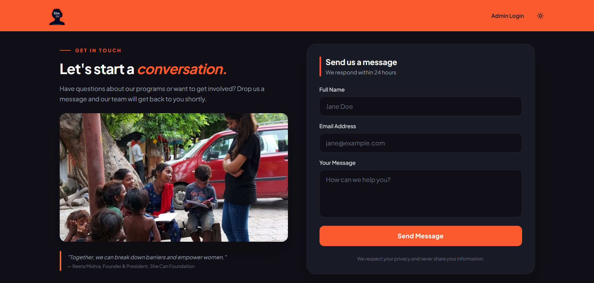

# She Can Foundation — Contact & Admin Portal

> A full-stack web application designed to facilitate public inquiries, featuring a public-facing contact form and a secure Admin Dashboard for managing submissions.



**Live Demo:** [shecanfoundation-form.vercel.app](https://shecanfoundation-form.vercel.app/)  

---

## Features

### Public Side
- Secure public contact form for inquiries
- Dark/light mode theme support with a customized dark-purple/violet UI
- Fully responsive design for both mobile and desktop
- Modern, accessible form inputs with active validation states

### Admin Panel
- Secure admin login system protected by Supabase Authentication
- Dashboard for viewing and managing user messages
- Real-time data fetching for the latest submissions
- Protected routing ensuring only authenticated users can access the dashboard

---

## Tech Stack

| Layer          | Technology                                    |
|----------------|-----------------------------------------------|
| Frontend       | React + Vite                                  |
| Styling        | Tailwind CSS                                  |
| Backend        | Vercel Serverless Functions / Custom API Routes |
| Database       | PostgreSQL (via Supabase)                     |
| Authentication | Supabase Auth                                 |
| Hosting        | Vercel                                        |

---

## Getting Started

### Requirements

- Node.js 18+
- npm or yarn
- Supabase Account

### Installation

**1. Clone the repository**
```bash
git clone https://github.com/tiin-tiin/shecanfoundation-form.git
cd shecanfoundation-form/form
```

**2. Install dependencies**
```bash
npm install
```

**3. Create environment file**
```bash
cp .env.example .env
```

**4. Configure `.env`**
```env
VITE_SUPABASE_URL=your_supabase_project_url
VITE_SUPABASE_ANON_KEY=your_supabase_anon_key
```

**5. Database Setup**

Execute the required SQL schema in your Supabase SQL Editor to create the `submissions` table and configure Row Level Security (RLS) policies.

**6. Start the development server**
```bash
npm run dev
```

**7. Visit the app**
- Public App: [http://localhost:5173](http://localhost:5173)
- Admin Login: [http://localhost:5173/admin](http://localhost:5173/admin)

---

## Admin Access

Authentication is handled securely via Supabase Auth. You can manage approved admin credentials and user access directly within your Supabase Dashboard under the **Authentication** tab.

---

## Project Structure

```
form/
├── .vercel/              # Vercel deployment configuration
├── api/                  # Vercel Serverless Functions
├── node_modules/         # Project dependencies
├── public/               # Static assets and images
├── src/
│   ├── assets/           # Media and asset files
│   ├── App.css           # Global application styles
│   ├── App.jsx           # Main application routing and state
│   ├── index.css         # Base/reset CSS styles
│   └── main.jsx          # React application entry point
├── .env                  # Environment variables (not committed)
├── .gitignore            # Git ignore rules
├── eslint.config.js      # ESLint configuration
├── index.html            # HTML entry point
├── package-lock.json     # Dependency lock file
├── package.json          # Project metadata and scripts
├── README.md             # Project documentation
└── vite.config.js        # Vite build configuration
```

---

## Serverless API Implementation

The contact form handles data securely via serverless architecture:

1. User submits the contact form on the frontend.
2. React sends a `POST` request to the `/api/submit` Vercel serverless function.
3. The serverless function validates the payload and securely inserts the record into the Supabase database.
4. The API returns a `{ success }` JSON response.
5. The UI updates instantly to display a success state and clears the form inputs.

---

## Acknowledgements & Copyright

© 2026 She Can Foundation Project. All Rights Reserved.

Visit the official website at: https://shecanfoundation.org/

This project was developed to fulfill professional internship assessment requirements. All branding and implementations are part of a candidate assessment project.